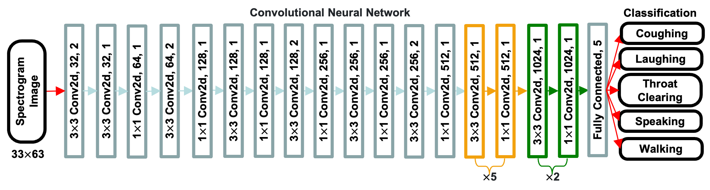

# Coughing Classification Task

## Introduction

This repo is official **[PyTorch](https://pytorch.org)** implementation of training and testing the coughing classification project. 

<p align="center">

</p>

**What this repo provides:**
* [PyTorch](https://pytorch.org) implementation of [Soft, Skin-Interfaced Multimodal Sensing Systems with Artificial Intelligence for Continuous Monitoring of COVID-19 Symptoms].
* Flexible and simple code.
* Classification training and testing code.
* Results visulization code.

## Dependencies
* [PyTorch](https://pytorch.org)
* [CUDA](https://developer.nvidia.com/cuda-downloads)
* [cuDNN](https://developer.nvidia.com/cudnn)
* [Anaconda](https://www.anaconda.com/download/)

This code is tested under Ubuntu 16.04, CUDA 9.0, cuDNN 7.1 environment with one NVIDIA TITAN GPU.

Python 3.6.5 version with Anaconda 3 is used for development.

## Directory

### Root
The `${CoughingClassificationTask}` is described as below.
```
${CoughingClassificationTask}
|-- data
|-- cf_matrix.py
|-- data_preparation.py
|-- roc_curve.py
|-- test_single_sample.py
|-- train_classification.py
```
* `data` contains 5 categories in different volunteers.
* `cf_matrix.py` used for visulize the confusion matrix.
* `data_preparation.py` pack the data into different folds. 
* `roc_curve.py` visulize the ROC curves' results. 
* `test_single_sample.py` test one single sample for demo. 
* `train_classification.py` train the classification model and output the training and testing results.

### Data
Please download the dataset in this **[Link](https://drive.google.com/file/d/17bhcMAxF1uNIjxTIcNvOPY-2vRhiKIAI/view?usp=sharing)**. 

You need to upzip the dataset and follow directory structure of the `data` as below.
```
${CoughingClassificationTask}
|-- data
|   |-- volunteer1
|   |   |-- coughing
|   |   |-- laughing
|   |   |-- speaking
|   |   |-- throat_cleaning
|   |   |-- walking
|   |-- volunteer2
|   |   |-- coughing
|   |   |-- laughing
|   |   |-- speaking
|   |   |-- throat_cleaning
|   |   |-- walking
|
`
`
|   |-- volunteers
|   |   |-- data_A.pth
|   |   |-- data_B.pth
|   |   |-- data_C.pth
|   |   |-- data_D.pth
```

If you have a problem with 'Download' problem when tried to download dataset from google drive link, please try this trick.  
```  
* Go the shared folder, which contains files you want to copy to your drive  
* Select all the files you want to copy  
* In the upper right corner click on three vertical dots and select “make a copy”  
* Then, the file is copied to your personal google drive account. You can download it from your personal account.  
```  

## Running Coughing Classification
### Start
* In the `main/config.py`, you can change settings of the model including dataset to use, network backbone, and input size and so on.

### Train
In the `main` folder, run
```bash
python train.py --gpu 0-1
```
to train the network on the GPU 0,1. 

If you want to continue experiment, run 
```bash
python train.py --gpu 0-1 --continue
```
`--gpu 0,1` can be used instead of `--gpu 0-1`.

### Test
Place trained model at the `output/model_dump/`.

In the `main` folder, run 
```bash
python test.py --gpu 0-1 --test_epoch 20
```
to test the network on the GPU 0,1 with 20th epoch trained model. `--gpu 0,1` can be used instead of `--gpu 0-1`.

<!-- ## Results
Here I report the performance of the PoseNet. 
* Download pre-trained models of the PoseNetNet in [here](https://drive.google.com/drive/folders/1El3qfdtgttO90X25k_680V2UCDv_TPoJ?usp=sharing) 
* Bounding boxs (from DetectNet) and root joint coordintates (from RootNet) of Human3.6M, MSCOCO, and MuPoTS-3D dataset in [here](https://drive.google.com/drive/folders/1bmQWFiT0ZU4Q7dlsRaPGqaqoCAOeThGr?usp=sharing). -->


