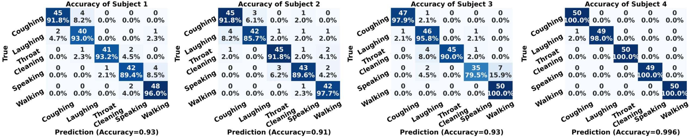
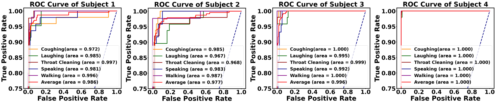

# Coughing Classification Task

## Introduction

This repo is official **[PyTorch](https://pytorch.org)** implementation of training and testing the coughing classification project. 

<p align="center">

</p>

**What this repo provides:**
* [PyTorch](https://pytorch.org) implementation of [Soft, Skin-Interfaced Multimodal Sensing Systems with Artificial Intelligence for Continuous Monitoring of COVID-19 Symptoms].
* Flexible and simple code.
* Classification training and testing code.
* Results visulization code.

## Dependencies
* [PyTorch](https://pytorch.org)
* [CUDA](https://developer.nvidia.com/cuda-downloads)
* [cuDNN](https://developer.nvidia.com/cudnn)
* [Anaconda](https://www.anaconda.com/download/)

This code is tested under Ubuntu 16.04, CUDA 9.0, cuDNN 7.1 environment with one NVIDIA TITAN GPU.

Python 3.6.5 version with Anaconda 3 is used for development.

## Directory

### Root
The `${CoughingClassificationTask}` is described as below.
```
${CoughingClassificationTask}
|-- data
|-- cf_matrix.py
|-- data_preparation.py
|-- roc_curve.py
|-- test_single_sample.py
|-- train_classification.py
```
* `data` contains 5 categories in five volunteers; also contains four folds of all data in `${volunteers}`
* `cf_matrix.py` used for visulize the confusion matrix.
* `data_preparation.py` pack the data into different folds. 
* `roc_curve.py` visulize the ROC curves' results. 
* `test_single_sample.py` test one single sample for demo. 
* `train_classification.py` train the classification model and output the training and testing results.

### Data
Please download the dataset in this **[Link](https://drive.google.com/file/d/17bhcMAxF1uNIjxTIcNvOPY-2vRhiKIAI/view?usp=sharing)**. 

You need to upzip the dataset and follow directory structure of the `data` as below.
```
${CoughingClassificationTask}
|-- data
|   |-- volunteer1
|   |   |-- coughing
|   |   |-- laughing
|   |   |-- speaking
|   |   |-- throat_cleaning
|   |   |-- walking
|   |-- volunteer2
|   |   |-- coughing
|   |   |-- laughing
|   |   |-- speaking
|   |   |-- throat_cleaning
|   |   |-- walking
|
`
`
|   |-- volunteers
|   |   |-- data_A.pth
|   |   |-- data_B.pth
|   |   |-- data_C.pth
|   |   |-- data_D.pth
```

If you have a problem with 'Download' problem when tried to download dataset from google drive link, please try this trick.  
```  
* Go the shared folder, which contains files you want to copy to your drive  
* Select all the files you want to copy  
* In the upper right corner click on three vertical dots and select “make a copy”  
* Then, the file is copied to your personal google drive account. You can download it from your personal account.  
```  

## Running Coughing Classification
### Start
* In the `train_classification.py`, you can change settings of the model including dataset, network backbone, and training visualization.
    ```python3
    Line 141: visualization = True
    ```

### Data Preparation
* In the `data_preparation.py`, you can choose the specific volunteers to randomly generate the training set and testing set. 
    ```bash
    python3 data_preparation.py 
    ```
* The prepared dataset is placed in ${data/volunteers}. You can directly use these files. 

### Train
* In the root folder, run
    ```bash
    python3 train_classification.py 
    ```
  to train the network on the GPU 0. 

 * You can simplely swith the backbone network by comment the following code

    ```python3
    Line 170
    # initialize the model (ResNet/mobileNetv2)
    model = resnet18(pretrained=True)
    model.fc = nn.Linear(512,5)
    model.conv1 = nn.Conv2d(1, 64, kernel_size=(7, 7), stride=(2, 2), padding=(3, 3), bias=False)
    
    # model = mobilenet_v2(pretrained=True)
    # model.features[0][0] = nn.Conv2d(1, 32, kernel_size=(3, 3), stride=(2, 2), padding=(1, 1), bias=False)
    # model.classifier[1] = nn.Linear(1280,5)
    ```

### Test
* Place trained model at the `models/`.
* You can modify the model root on Line 64
    ```python3
    model_path = os.path.join('models', 'best.pth')
    ```
* In the `root` folder, run 
  ```bash
  python3 test_single_sample.py
  ```
  to test the network on the GPU 0 with the best trained model. 

## Results
The performance can be visulize in two perspectives, including confusion matrix and ROC curves. 

### Confusion Matrix
* The testing confusion matrix can be found during the training progress.
* In the root folder, run
    ```bash
    python3 cf_matrix.py 
    ```
  to visulize the confusion matrix in paper format. 

* You can simplely modify the confusion matrix by revise the Line 137. It can calculate the accuracy automatically and present on the bottom of the confusion matrix. Please see the follow example. 
  
    <p align="left">
    
    </p>


### ROC Curves
* In the root folder, run
    ```bash
    python3 roc_curve.py 
    ```
  to visulize the ROC Curve and AUC values in paper format. 

* You can simplely setup the models by revise the Line 139.
  ```python3
  loaded_dict_enc = torch.load('./models/best.pth', map_location=device)
  ```
* You also can simple choose the testing set by modify the Line 121.
  ```python3
  data_test = A
  ``` 
* It can calculate the AUC values automatically and present on the bottom of the ROC curves. Please see the follow example. 
  
    <p align="left">
    
    </p>